# Documentacion de Reportes en c# y PHP

---
## - PHP

#### Antes que nada para crear un reporte en php, debemos crear la interfaz, donde se podran ver los datos de nuestra tabla en nuestra respectiva *base de datos* que en mi caso es sqlsrv, asi que comenzaremos por:

###  -- Menu

#### El menu, donde podremos navegar del indice al lugar de la creacion de la factura.


---

#### Luego tenemos el lugar donde se veran los nuevos datos ingresados y los viejos, que estan guardados en la base de datos.
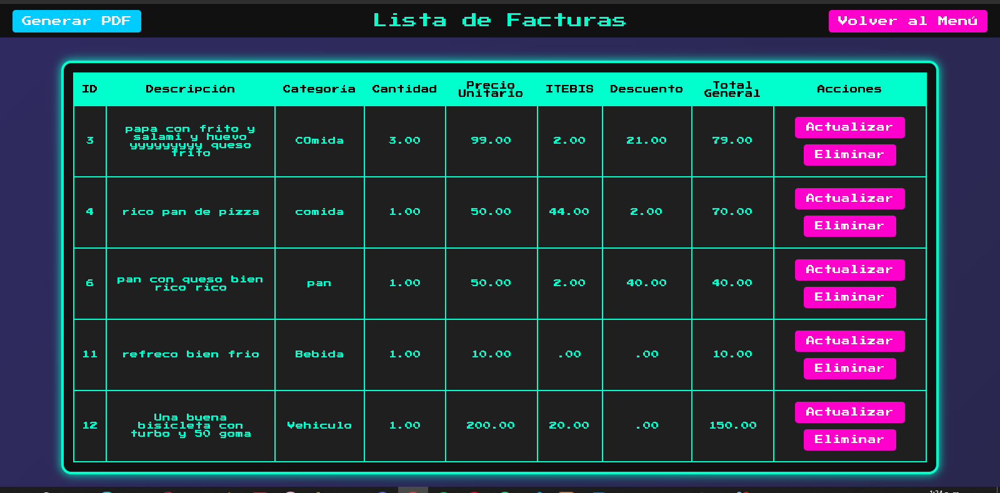

---

#### Y luego tenemos el lugar donde se crean las nuevas facturas
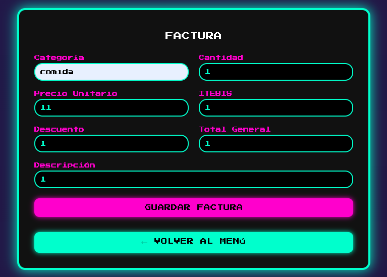

##### Para comprobar que se añadio


---

## Ahora veremos con se obtiene el reporte

#### Primero debemos descargar la libreria que se nos haga mas comoda usar, que en mi caso fue fpdf. Luego de decidir la libreria a usar la descargamos y la metemos en nuestro proyecto
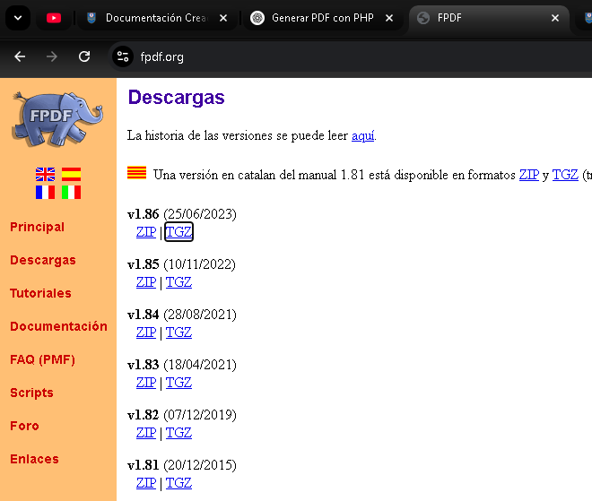
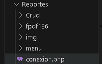

---

#### Luego de hacer esto debemos crear el boton que vimos al principio en el indice, el cual se encargara de crear el formulario, pero este boton no trabaja solo, tiene una logica por detras, que en mi caso la llame generar_facturas_pdf:

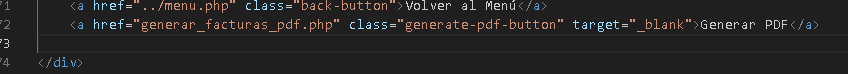

#### Ahora debemos que hacer la logica que va detras del ese simple boton que esta en nuestro indice:

``` php

<?php
require('../fpdf186/fpdf.php');
$pdf = new FPDF();
$pdf->AddPage('L'); 
$pdf->SetFont('Arial', 'B', 12);
$pdf->Cell(0, 10, 'Lista de Facturas', 0, 1, 'C');
$pdf->Ln(10);
include_once("../conexion.php");
$query = "SELECT * FROM Facturas";
$stmt = sqlsrv_query($conn, $query);
if ($stmt === false) {
    die(print_r(sqlsrv_errors(), true));
}


$pdf->Cell(15, 10, 'ID', 1);
$pdf->Cell(60, 10, 'Descripcion', 1);
$pdf->Cell(40, 10, 'Categoria', 1);
$pdf->Cell(25, 10, 'Cantidad', 1);
$pdf->Cell(30, 10, 'Precio Unit.', 1);
$pdf->Cell(25, 10, 'ITEBIS', 1);
$pdf->Cell(30, 10, 'Descuento', 1);
$pdf->Cell(30, 10, 'Total', 1);
$pdf->Ln();

$pdf->SetFont('Arial', '', 10);
while ($row = sqlsrv_fetch_array($stmt, SQLSRV_FETCH_ASSOC)) {
    $pdf->Cell(15, 10, $row['ID'], 1);
    $pdf->Cell(60, 10, substr($row['DESCRIPCION'], 0, 35), 1);
    $pdf->Cell(40, 10, substr($row['CATEGORIA'], 0, 20), 1);
    $pdf->Cell(25, 10, $row['CANTIDAD'], 1);
    $pdf->Cell(30, 10, number_format($row['PRECIO_UNITARIO'], 2), 1);
    $pdf->Cell(25, 10, number_format($row['ITEBIS'], 2), 1);
    $pdf->Cell(30, 10, number_format($row['DESCUENTO'], 2), 1);
    $pdf->Cell(30, 10, number_format($row['TOTAL_GENERAL'], 2), 1);
    $pdf->Ln();
}
$pdf->Output();
?>

```

#### Este codigo lo que hace basicamente es que, llama a la libreria descargada, y luego de llamar a nuestros campos para que aparezcan en un tabla ordenada, y todo al final se vea en un pdf horizontal, tpdo esto luego de, obviamente, incluir la conexion para que no hayan confusiones, y tambien luego de haber hecho la query *select * from*

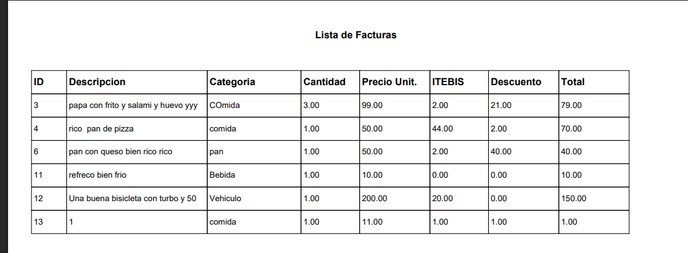

---

## - C#

### Luego de haber aprendido a hacer nuestros reportes y como imprimir nuestros reportes en PHP, ahora aprenderemos a como hacerlo en C#

#### Primero que todo debemos, hacer nuestra conexion con nuestra base de datos, que, en mi caso, es la misma que la de php. Suponiendo que ya hemos hecho lo mas basico del CRUD con nuestro formulario funcionar y todo, ahora vamos a incluir algo nuevo, un boton para imprimir nuestro reportes.

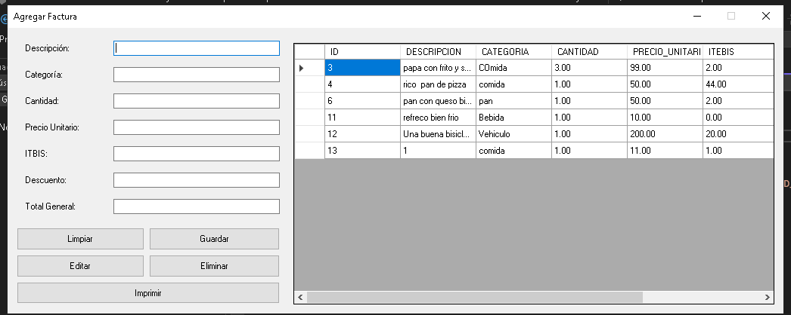
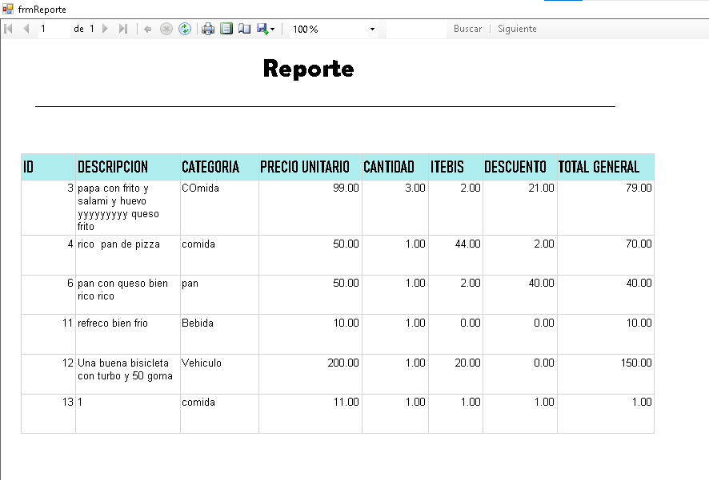

#### Comenzemos antes que nada creando nuestro boton, que lo llamaremos Imprimir, y en mi caso por cuestiones de comodidad en cuando tengamos que llamarlo le pondremos el nombre de *btnimprimir*.

#### Despues de ya haber creado nuestro boton, tendremos que darle una funcion a este. En mi caso, este boton nos llevara al reportviewer que crearemos, mas adelante les explico.

#### Tendremos que crear un nuevo formulario en nuestro proyecto, le ponen el nombre que prefieran, solo que luego no se les olvide, en este nuevo formulario que hemos creado, lo que haremos buscar en nuestro cuadro de herramientas, el respectivo report viewer, y a este, en el apartados de propiedades buscaquermos *Dock* y cambiaremos este a fill (Esto es opcional pero es lo mejor por estetica).

#### Luego de hacer esto, tendremos que ir a la parte de arriba de nuestro espacio de trabajaremos y clickaremos en proyecto y luego en añadir nuevo elemento, luego de hacer esto debemos buscar data set y añadirlo, con el nombre que mas comodo se le haga, siempre y cuando tenga algo que ver, para poder recordarlo mas facil, y tambien buscaremos el elemento de informe, y le pondremos un nombre que tenga que ver con reportes.

#### luego de hacer esto tendremos que configurar nuestro dataset, mas que configurar, seria añadir nuestra tabla de nuestra base de datos a el dataset, luego de esto, iremos a nuestro informe que se supone que llamamos reporte, le damos click derecho, luego insertar y luego tabla, luego de esto, tendra que expandir la tabla segun los campos que se encuentren es su tabla, y luego en la parte de abajo de la tabla habra un boton, que estara vinculado a su data set e ira añadiendo sus campos y automaticamente su nombre.

#### Al terminar de añadir todo tendra que darle diseño para que sea mas vicible, este seria poniendole un titulo al reporte, esto se hace con click derecho en espacio en blanco y añadir encabezado, en el encabezado tendra que poner un text box, para luego poner el titulo, y luego de darle click izquierdo a la tabla dentro de ella, arriba podra darle formato, para que al final quede algo como esto:

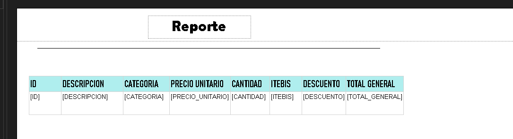

#### Ya despues de terminar de esto, tendra que ir a codificar, ira a su frmreporte.cs para hacer que cuando le de al boton imprimir lo mande a frmreporte y cuando esto pase en el load del formulario, ahi se cargue el informe que seria lo que hicimos mas arriba, esto se veria de esta forma:

```C#
        private void frmReporte_Load(object sender, EventArgs e)
        {
            DataTable dt = new DataTable();

            // Llenas el DataTable con datos de la base de datos mediante un adaptador
            SqlDataAdapter adapter = new SqlDataAdapter("SELECT * FROM Facturas", Conexion.cadenaConexion);
            adapter.Fill(dt);

            // Paso 2: Asociar los datos al reporte
            ReportDataSource dataSource = new ReportDataSource("wao", dt); // "dataset" debe coincidir con el nombre en el reporte
            reportViewer1.LocalReport.DataSources.Clear();
            reportViewer1.LocalReport.DataSources.Add(dataSource);

            // Paso 3: Refrescar y mostrar el reporte
            reportViewer1.RefreshReport();

            this.reportViewer1.RefreshReport();
        }
    }
}
```
#### Y luego de hacer que nuestro boton de imprimir me mande al formulario frmreporte:
```C#
private void btnImprimir_Click(object sender, EventArgs e)
    {
        frmReporte reporte = new frmReporte();
        reporte.ShowDialog();
    }
     
```
#### Para que al final todo se vea de esta forma
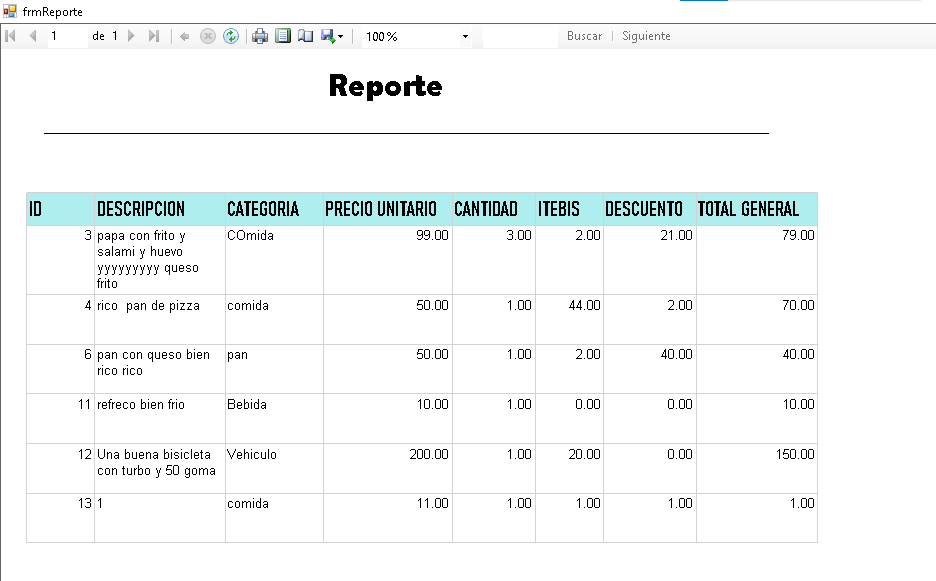

#### Y en Pdf:
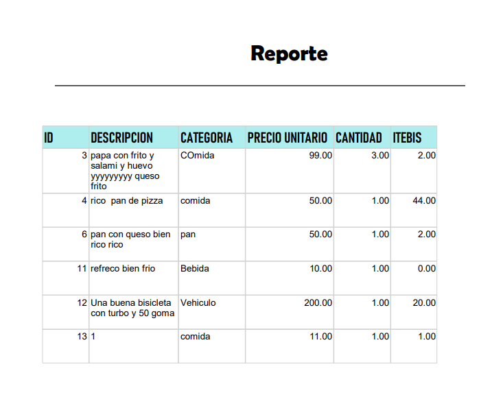
